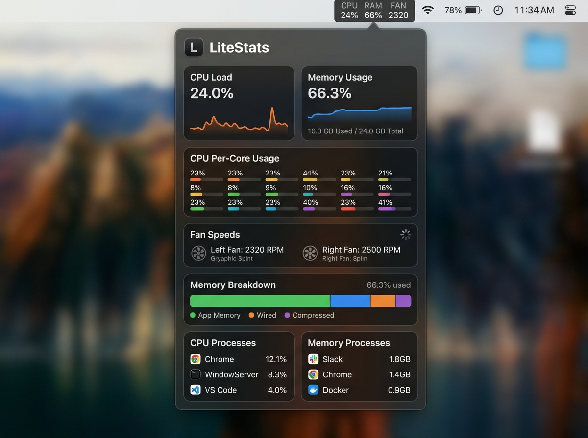
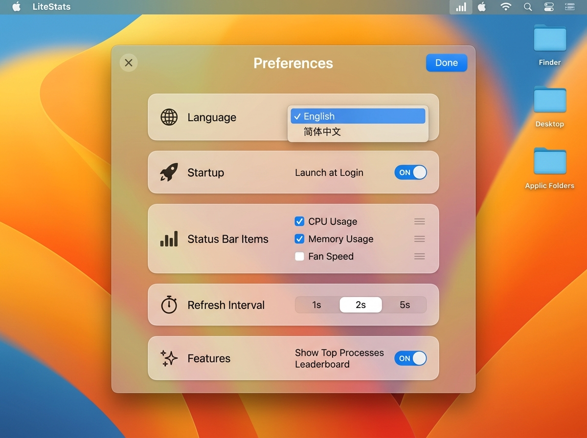

# 🚀 LiteStats - Native & Ultra-Lightweight macOS Status Bar Monitor

<p align="center">
  
  
  
  
</p>

[English README](./README.md) | [中文说明](./README_CN.md)

---

## 📊 Performance Benchmarks — Why LiteStats?

**This is the whole point of LiteStats.** Sampled over 10 minutes (120 consecutive real-time samples) on an M-Series MacBook Pro:

| Metric | LiteStats | Electron Alternatives | Advantage |
| :--- | :--- | :--- | :--- |
| **App Bundle Size** | **656 KB** | ~150 MB - 300 MB | 🟢 **99.6% smaller** |
| **Memory Footprint (RSS)** | **37 MB** | ~150 MB - 350 MB | 🟢 **80%+ less RAM** |
| **Idle CPU Usage** | **0.0%** | ~2.0% - 5.0% | 🟢 **Zero background drain** |
| **Power Score** | **0.0** | ~15.0 - 30.0 | 🟢 **Zero battery impact** |

*"Electron Alternatives" reflects the general resource footprint typically reported for Electron/Webview-based menu bar utilities, not a specific named competitor.*

---

## 📸 Screenshots & Showcase

<p align="center">
  
  
</p>

---

## 📌 Background & Motivation

On macOS, system monitoring tools like Stats, iStat Menus, or Electron-based widgets are very popular. However:
- ❌ **Heavy Resource Usage**: They often consume **150MB ~ 300MB RAM** and **2% ~ 5% continuous background CPU**, leading to thermal buildup and reduced battery life.
- ❌ **Menu Bar Waste**: Long horizontal text strings crowd out the macOS notch area and other menu items.
- ❌ **Overhead**: Inefficient polling loops drain laptop battery unnecessary.

**LiteStats** was created to solve these exact pain points as a **Zero-Bloat, Pure Native** system monitor:
- ⚡ Uses **only ~37 MB RAM** and **~0.0% CPU** (a **99% reduction** in resource overhead compared to Electron alternatives).
- 📐 Features a **2-line stacked vertical menu bar layout** (`CPU / RAM / FAN` on top, live values below), saving >60% horizontal notch space.
- 🌀 Direct C-bridge to AppleSMC hardware for dual-fan RPM readings on MacBook Pro/Air/Mac Studio.

---

## ✨ Key Features

1. **Ultra-Compact Stacked Status Item**
   - 2-line vertical alignment (`CPU  RAM  FAN` / `24%  66% 2320`) within 22pt status bar height.
   - Independent toggles for CPU, RAM, and Fan visibility.
   - Dynamic high-contrast theme adaptation for Dark Mode and Light Mode.

2. **Rich SwiftUI Popover Dashboard**
   - 📈 **60s Live Sparkline Charts**: Real-time trend graphs for CPU and memory usage.
   - 🔲 **Per-Core CPU Grid**: Individual progress bars for all P-Cores and E-Cores.
   - 🧠 **Memory Breakdown**: Active, Wired, Compressed, Free, and Swap metrics.
   - 🌀 **Dual-Fan SMC Speed Monitoring**: C-bridge reading Left & Right Fan RPM (auto-detects Fanless hardware).
   - 🔝 **Top 5 Resource Consumers**: Real-time CPU and Memory process leaderboards with 1-click process termination (`Kill`).

3. **Pure Native Performance**
   - Powered by Swift 6, Mach Kernel C APIs (`host_processor_info` / `host_statistics64`), and IOKit AppleSMC. Zero third-party dependencies.

---

## 🔨 Build & Installation Guide

Built directly via Command Line Tools (`swiftc` & `clang`). No Xcode GUI required.

### Prerequisites
- macOS 13.0 (Ventura) or newer
- Xcode Command Line Tools (`swiftc` and `clang`)

### Building & Running

1. Clone the repository:
   ```bash
   git clone https://github.com/your-username/LiteStats.git
   cd LiteStats
   ```

2. Make scripts executable and build:
   ```bash
   chmod +x build.sh run.sh
   ./build.sh
   ```
   *The built application bundle will be created at `build/LiteStats.app`.*

3. Launch the app:
   ```bash
   ./run.sh
   ```
   *You can also double-click `build/LiteStats.app` in Finder or drag it into `/Applications`.*

---

## 📁 Repository Structure

```
LiteStats/
├── assets/                      # UI Screenshots & media
├── build/
│   └── LiteStats.app            # Compiled app bundle
├── Sources/
│   ├── Main.swift              # Main entry point & NSApplication delegate
│   ├── SMCBridge.h             # C SMC driver header (80-byte struct)
│   ├── SMCBridge.c             # C AppleSMC reader (FNum, F0Ac, F1Ac)
│   ├── SMCReader.swift         # Swift fan speed adapter
│   ├── SystemMonitor.swift     # Mach kernel C API system monitoring
│   ├── ProcessManager.swift    # Top 5 process sampler & kill actions
│   ├── StatusBarController.swift # 2-line vertical status bar controller
│   ├── MonitorView.swift       # SwiftUI popover dashboard
│   └── SettingsStore.swift     # User preferences store
├── Info.plist                  # LSUIElement=true config (hide Dock icon)
├── build.sh                    # One-click build script
├── run.sh                      # One-click run script
├── LICENSE                     # License file
└── README.md                   # English documentation
```

---

## 📜 License Recommendations

This project is licensed under the **MIT License**.

---

## 🤝 Contributing

Contributions, Issues, and Feature Requests are welcome! Feel free to leave a ⭐ Star if you find LiteStats useful!
